## [fit] Community Intelligence
## [fit] & Open Source Tools
### [fit] __Building an Actionable Pipeline__

---

# Intro

---


# Me__:__
## Scott J Roberts
## @sroberts
#### _Han Solo is my Spirit Animal_

^ Most places at least.

---

## _What do CTI industry analysts say?_


> "When it comes to eating @sroberts is a thought leader up & to the right on all quadrants!"

~ [@rickhholland](https://twitter.com/rickhholland/status/694704632677933057)

---

## DFIRing Since __2006__
## CTIing Since __2007__
## Deving Since __2009__

---


---


---


## The Problem

### We are spinning up considerable new telemetry using open source tools and we need to feed those tools with actionable __intelligence__.

---


# The __Other__ Problem

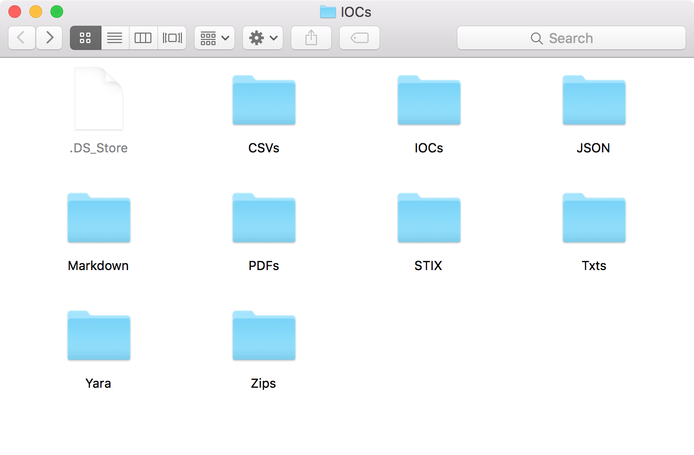

---

# _Pocket_
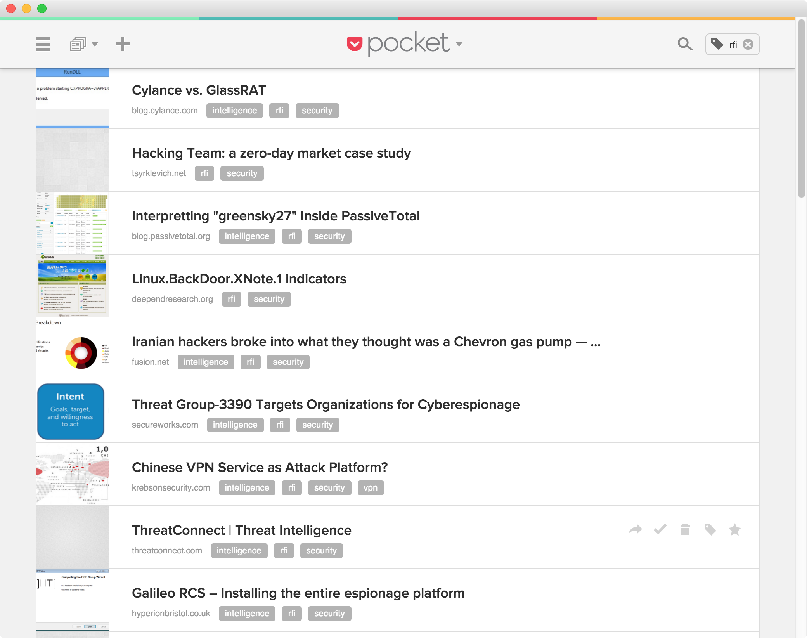

---

# _Chat_


---


# Note Books

---

# And all the other sources...

---


# __$$$$__

---

## [fit] So I did what anyone with a little Python experience does
## [fit] __I built my own...__

---

## [fit] And I built my own again...
## [fit] _And another time..._
## [fit] In the end I built about __5 or 6__...

---

## [fit] _They all sorta sucked..._ :cry:

---


> "I have not failed. I have found I've just found 10,000 ways that won't work."
## ~ Thomas Edison

---


## [fit]◉ __Direction__

---


# [fit]Breath __vs.__ Depth

---

## [fit] __OSX__, __Linux__, & __GitHub__
## [fit] centric threats

---


## [fit]◉ __Collection__

---

## Twitter
## Email Lists
## Feeds
## Ongoing Incidents
## Manual

^ Google Alerts, Scumblr

---


## [fit]◉ __Exploitation__

---

## [fit] _To Use a Technical Term_
## [fit] Indicator Extraction
## [fit] __sucks__...

---

## [fit] But we did it __anyway__...[^1]

[^1]: YOLO!!!

---

## [fit] Jager & Caçador [^2]

[^2]: _Look it means hunter in Portuguese._

---

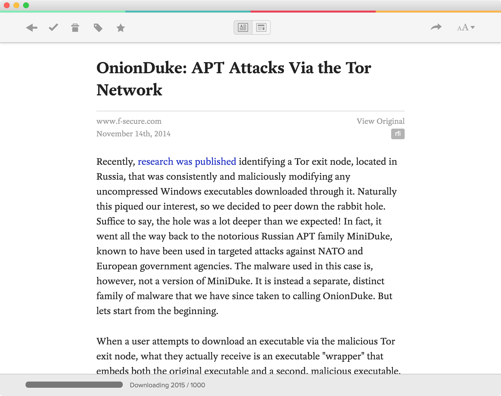

---

# Command
```
$ pbpaste | cacador | jq '.[]'
```

---

# Output
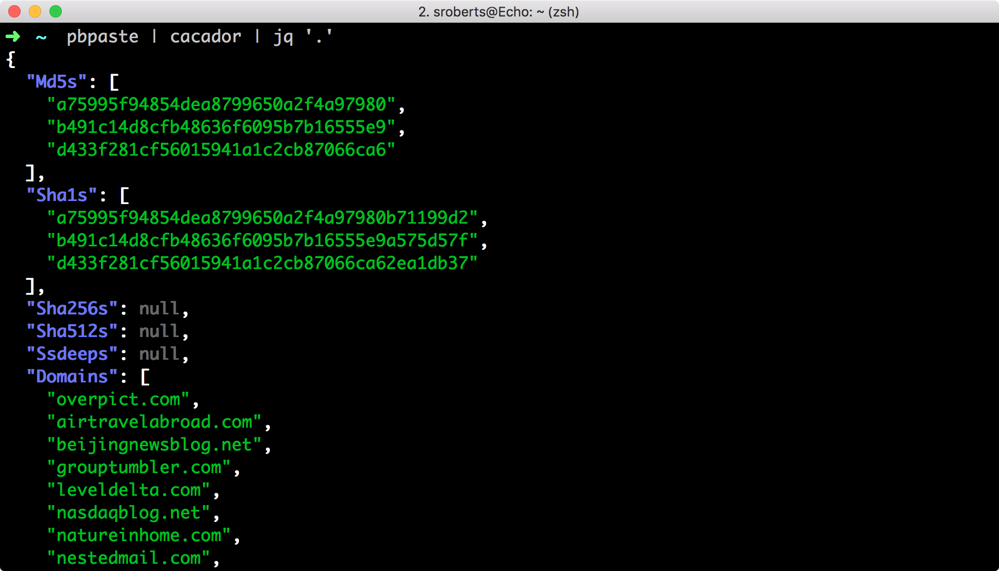

---

# Tada!!!

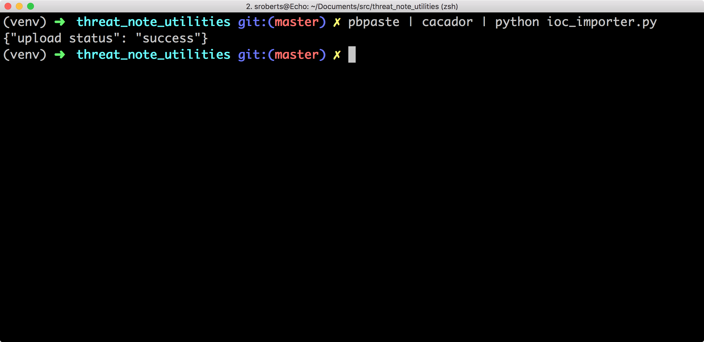

---


## [fit]◉ __Analysis__

---

## Threat Note

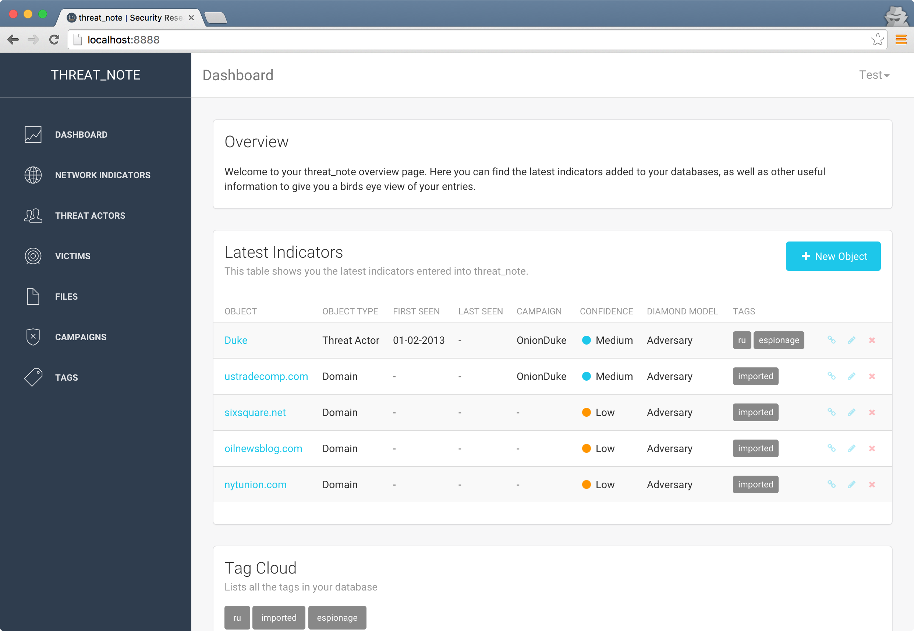

---


---

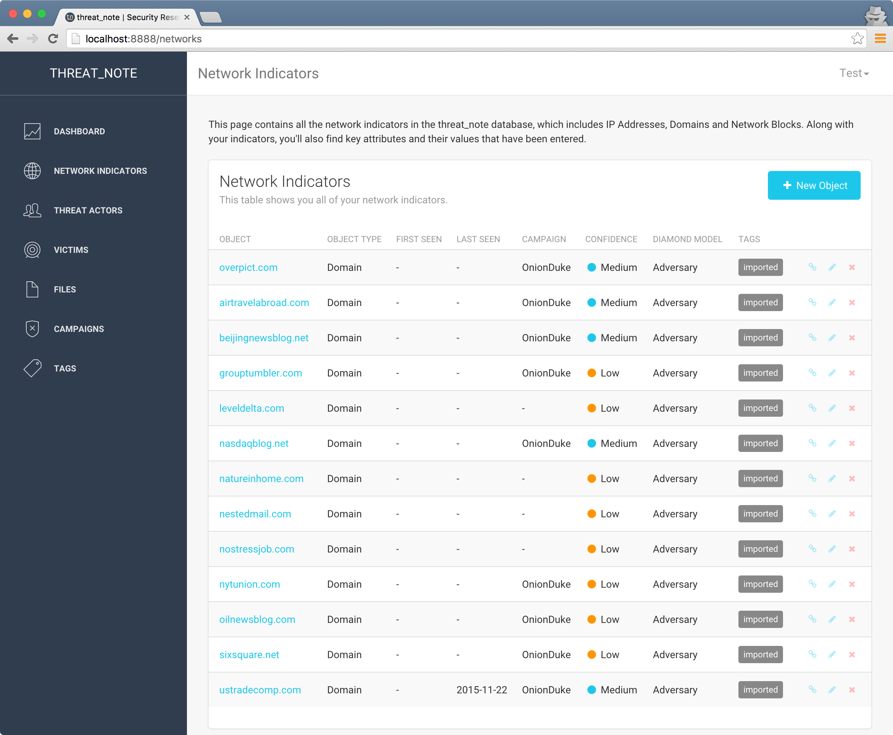

---

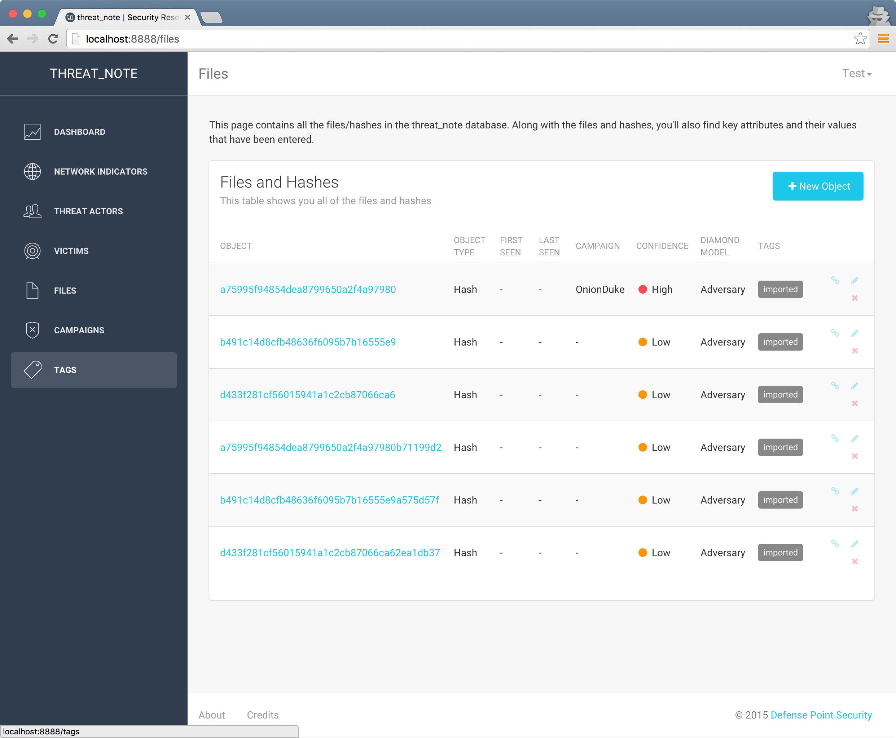

---

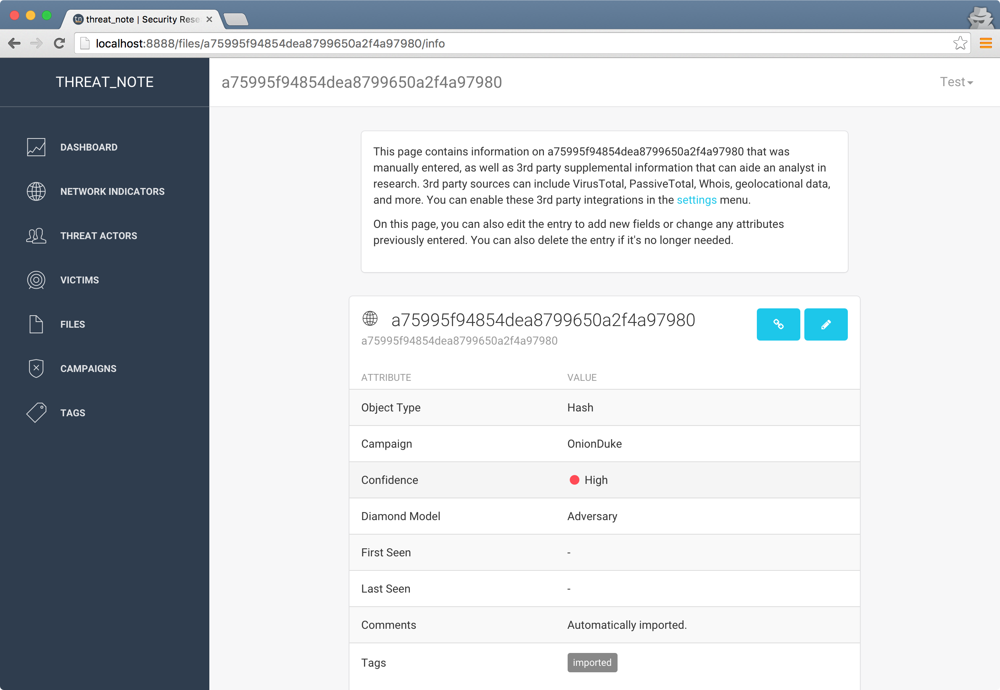

---

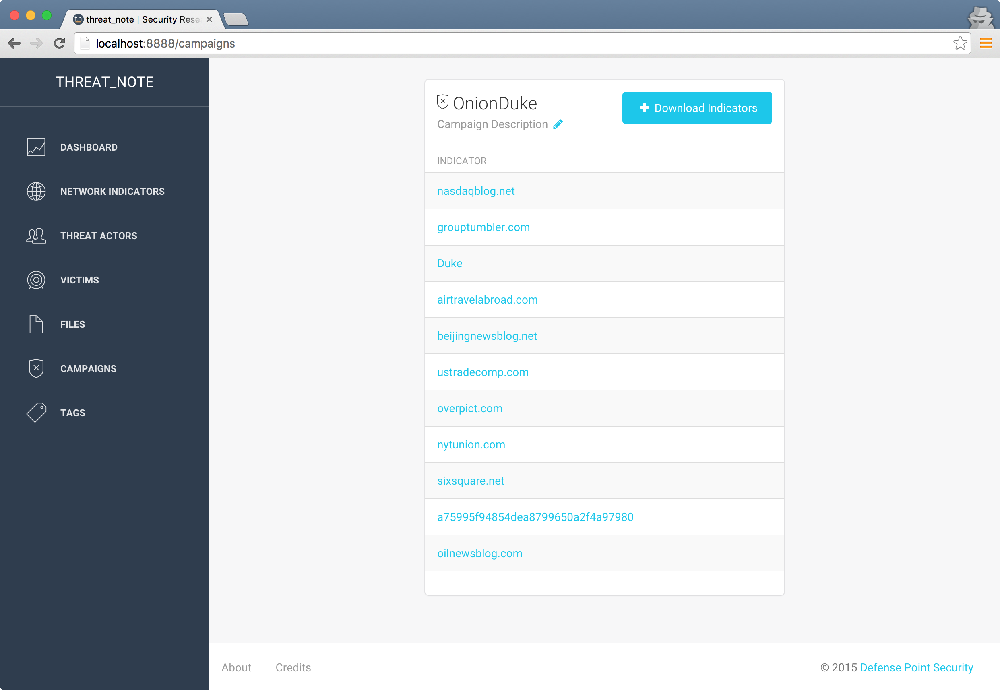

---

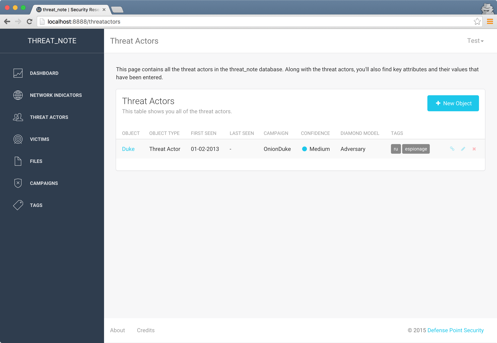

## _**Enrichments**_
### Whois
### PassiveTotal
### Shodan
### VirusTotal

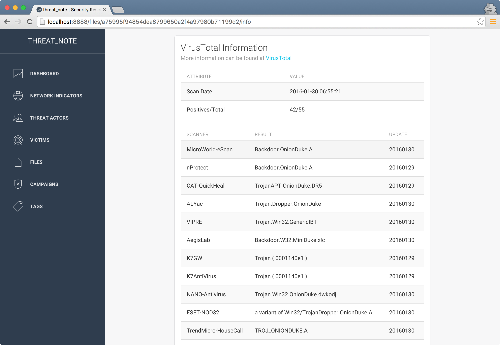

---


---

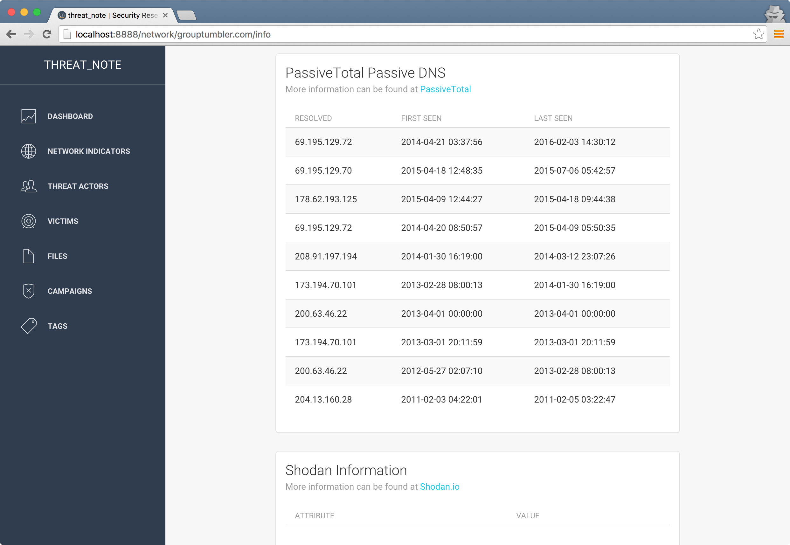

---

## [fit] Maltego


---

# [fit] Fast
# [fit] Incident
# [fit] Response
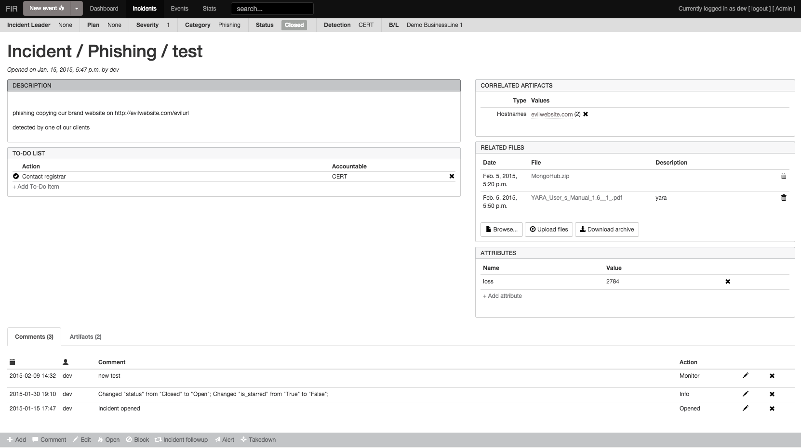

---


## [fit]◉ __Dissemination__

---

# __Now__
## Manual

---

## __Soon:tm:__
### osquery & Bro Intelligence
### Chat with Hubot
### Intelligence Reports
### Application Integration

---


## [fit]◉ __Feedback__

---

# [fit] _The Result_

---


---

##__*The _(REAL)_ Result*__
### A (somewhat) automated system providing centralized _threat data_ & _intelligence management_ made up of a __single source of truth supported by purpose built collection, processing, and analysis integrations__.

---

# [fit] _Lessons_

---

# [fit] This isn't __easy__
# [fit] _But **parts** are._

---

## [fit] Threat Intel Tools Work
## [fit] When They're __Integrated__
## ~
## [fit] collection __|__ analysis __|__ dissemination

---


# [fit] _High Value Investments_

### __Tool:__ Paterva Maltego ~ $760
### __Service:__ PassiveTotal ~ $??
### __Learning:__ Introducing Python ~ $33

---


# [fit] Learn to __Code__

---

_and_Dennis_Ritchie_at_PDP-11_\(2876612463\).jpg)
# [fit] __Unix Philosophy__
### Small is beautiful
### Make each program do one thing well
### Portability over efficiency
### Store data in flat files
### Make every program a filter

---


# [fit] Data formats matter less than format openness
# [fit] CSV __&__ JSON

---

## [fit] _Perfect_
## __Is the Enemy Of__
## [fit] _Good_

---


## __*The Future:*__
### Scaling Up Collection & Storage
### Expanded Threat_Notes APIs & Integrations
### Reputation & Fuzzy Indicators

---

# __*Links*__
github.com/defpoint/threat_note  
github.com/certsocietegenerale/FIR
github.com/sroberts/jager
github.com/sroberts/cacador
github.com/kbandla/APTnotes
github.com/armbues/ioc_parser
github.com/ivanlei/threatbutt

---

## __*Thanks*__
#### _Threat Note:_ @brianwarehime
#### _FIR:_ @thomchop_
#### _APTNotes:_ @kbandla
#### _Jager:_ @kylemaxwell, @kbandla, & @deadbits

---

## [fit] __*Questions???*__

### ~

### @sroberts
### http://sroberts.github.io
